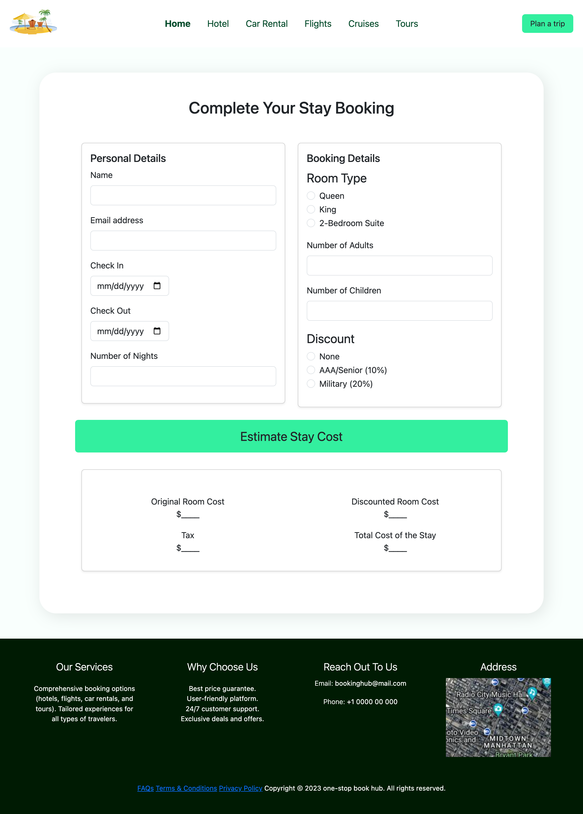
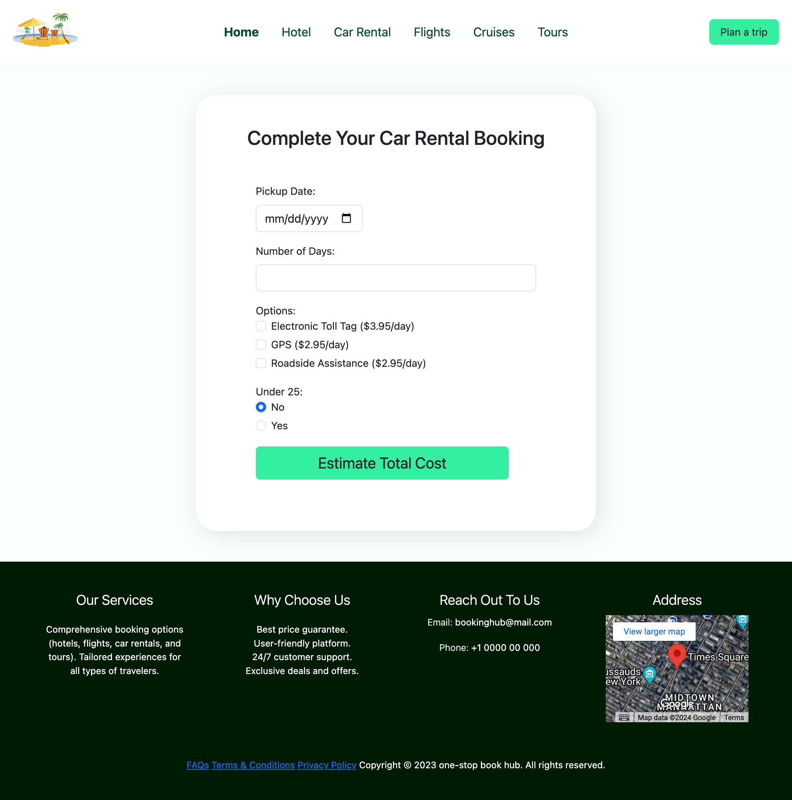

# Booking Hub

This project is a booking system designed for travel and stay services. It lets users easily book hotels, rent cars, and arrange stays using a simple web interface. Created with JavaScript, it offers useful features that make booking smooth and interactive.

## Demo
To view a demo of this project, visit: [ [Booking Hub ](https://booking-hubio.netlify.app/)]

## Contact
For any inquiries or issues, please open an issue on the repository or contact aaungdev@outlook.com
